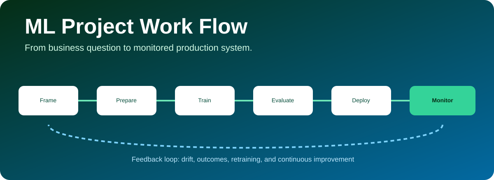

<p align="center"></p>

# ML Project Work Flow

A practical guide to taking a machine-learning project from an ambiguous business question to a reliable, monitored production system. The repository combines lifecycle guidance with tested Python case studies for classification, regression, clustering, and drift monitoring.

## The complete lifecycle

| Phase | Core question | Key deliverable |
|---|---|---|
| 1. Problem framing | What decision should improve? | ML canvas, target, unit, horizon, constraints |
| 2. Data definition | Can every field be known at prediction time? | Data contract and leakage review |
| 3. Exploration | What quality, bias, and structure exist? | EDA report and validation rules |
| 4. Splitting | How will future performance be simulated? | Train/validation/test strategy |
| 5. Baseline | What simple approach must ML beat? | Dummy and business-rule benchmarks |
| 6. Feature pipeline | How are transformations reproduced safely? | Leakage-safe preprocessing pipeline |
| 7. Modeling | Which model family matches the problem? | Cross-validated candidates |
| 8. Evaluation | Is the model useful, calibrated, and fair enough? | Metric, error, threshold, and slice analysis |
| 9. Packaging | Can training and inference remain consistent? | Serialized pipeline and model card |
| 10. Deployment | How will predictions be served and governed? | Batch/API design, versioning, rollback |
| 11. Monitoring | Is data or performance changing? | Drift, quality, latency, and outcome alerts |
| 12. Improvement | When and why should the model retrain? | Feedback loop and retraining policy |

## Included case studies

| File | Technique | Output |
|---|---|---|
| [`ml-project-workflow-advanced-case-study.ipynb`](ml-project-workflow-advanced-case-study.ipynb) | Six classifiers, four regressors, temporal forecasting, causal uplift, and measured drift | Executed comparisons, calibration, conformal intervals, capacity policies, and reload-tested artifacts |
| [`ml-project-workflow-case-study.ipynb`](ml-project-workflow-case-study.ipynb) | Full churn-classification project | Framing through monitoring-ready export |
| [`classification_workflow.py`](case_studies/classification_workflow.py) | Mixed-type pipeline, stratification, CV, tuning, thresholding | ROC AUC, PR AUC, confusion matrix, model artifact |
| [`regression_workflow.py`](case_studies/regression_workflow.py) | Baseline comparison, gradient boosting, residuals | MAE, RMSE, R², predictions |
| [`clustering_workflow.py`](case_studies/clustering_workflow.py) | Scaling, K-Means, silhouette selection, PCA | Cluster profiles and assignments |
| [`monitoring_workflow.py`](case_studies/monitoring_workflow.py) | KS drift tests and alert policy | Feature and prediction drift report |

## Quick start

```bash
git clone https://github.com/JCZY999/ML-Project-Work-Flow.git
cd ML-Project-Work-Flow
pip install -r requirements.txt

python case_studies/classification_workflow.py
python case_studies/regression_workflow.py
python case_studies/clustering_workflow.py
python case_studies/monitoring_workflow.py
```

## Advanced end-to-end case study

Open [the advanced notebook](ml-project-workflow-advanced-case-study.ipynb) and run all cells in order after installing the requirements. It uses seeded, independent synthetic lead cohorts plus separate forecasting and randomized-treatment datasets. Embedded tables and charts are generated by execution.

- Compare a prevalence baseline, logistic regression, random forest, extra trees, histogram boosting, and an RBF SVM.
- Separate model selection, probability calibration, and final evaluation; report bootstrap uncertainty and top-15% capacity metrics.
- Compare four revenue regressors and construct 90% split-conformal prediction intervals.
- Backtest seasonal naive, ridge, and boosted-lag forecasts using expanding windows.
- Compare S- and T-learner offer policies with randomized IPW evaluation and simulation-only oracle diagnostics.
- Score actual synthetic traffic, missingness, and concept-shift cohorts; export CSV results, a model card, and a reload-tested inference bundle.

Artifacts are created in `advanced_case_study_artifacts/` relative to the notebook's working directory. The notebook records the executed package versions. Results are educational simulations, not real campaign performance or a production deployment.

## 1. Frame the problem before choosing an algorithm

Define the decision, prediction unit, target, prediction horizon, action, benefit, error costs, latency, and constraints. A strong ML objective connects technical metrics to an operating decision.

Example: “Predict 30-day churn risk for active subscribers every Monday so the retention team can contact at most 5,000 customers.” This immediately implies ranking quality, capacity-aware thresholding, delayed labels, and intervention evaluation.

## 2. Define data and prevent leakage

- Create a data contract with field meaning, type, owner, freshness, and allowed values.
- Confirm every feature exists at the real prediction timestamp.
- Remove target proxies, post-outcome fields, duplicate entities, and future aggregates.
- Split by time or entity when random rows would leak related observations.
- Fit imputers, encoders, scalers, and feature selectors only on training folds.

Use a single `Pipeline` and `ColumnTransformer` so training and inference transformations stay identical.

## 3. Explore and validate

Inspect missingness, duplicates, invalid ranges, class balance, outliers, correlations, cardinality, temporal stability, subgroup representation, and label quality. EDA should produce automated assertions—not only charts.

## 4. Choose the right validation design

| Data structure | Appropriate split |
|---|---|
| Independent rows | Stratified random split |
| Time-dependent outcomes | Forward/time split |
| Repeated users or devices | Group split |
| Geographic generalization | Region holdout |
| Small dataset | Repeated or nested cross-validation |

Keep the test set untouched until the modeling workflow is fixed. Use nested CV when hyperparameter-selection bias matters.

## 5. Establish baselines

Classification baselines include majority class, historical rate, and simple logistic regression. Regression baselines include mean, median, seasonal naïve, and existing business rules. A complex model that does not beat a relevant baseline should not ship.

## 6. Preprocessing and feature engineering

Common techniques include median or model-based imputation, standardization, robust scaling, one-hot/ordinal/target encoding, log transforms, interactions, aggregations, lag and rolling features, text embeddings, image augmentation, dimensionality reduction, and feature selection.

Feature engineering must respect the prediction timestamp and be reproducible online or in batch.

## 7. Model families

- **Classification:** logistic regression, trees, random forests, gradient boosting, SVMs, neural networks.
- **Regression:** linear/regularized models, tree ensembles, boosting, quantile regression.
- **Clustering:** K-Means, hierarchical clustering, DBSCAN/HDBSCAN, Gaussian mixtures.
- **Time series:** naïve/seasonal baselines, exponential smoothing, ARIMA, boosted lag models, deep sequence models.
- **NLP / vision:** transfer learning and foundation-model embeddings with task-specific evaluation.
- **Anomaly detection:** isolation forest, one-class methods, autoencoders, robust statistical rules.

Start simple. Increase complexity only when it creates stable decision value.

## 8. Metrics and error analysis

| Task | Useful metrics |
|---|---|
| Imbalanced classification | PR AUC, recall, precision, F-beta, log loss |
| Ranking | Lift, gain, precision@k, NDCG |
| Probability decisions | Calibration, Brier score, expected cost |
| Regression | MAE, RMSE, RMSLE, MAPE with care, R² |
| Clustering | Silhouette, stability, profile usefulness |
| Forecasting | Rolling backtests, MAE/WAPE, interval coverage |

Always inspect errors by time, geography, customer segment, acquisition source, device, and other relevant slices. Tune the operating threshold using costs and capacity, not the default 0.5.

## 9. Interpretability, fairness, and robustness

Use coefficients, permutation importance, partial dependence, SHAP, counterfactual examples, or monotonic constraints according to stakeholder and risk needs. Test performance and calibration across relevant groups. Probe missing data, adversarial values, seasonal shifts, and alternative splits.

Interpretability explains model behavior; it does not convert associations into causal effects.

## 10. Deployment

Choose batch, streaming, or real-time serving based on decision latency. Version code, data, features, model, and configuration. Validate the inference schema, package preprocessing with the estimator, use shadow/canary releases, define rollback, and document ownership.

## 11. Monitoring

Monitor four layers:

1. **System:** latency, throughput, errors, resource use.
2. **Data:** schema, missingness, ranges, categories, feature drift.
3. **Predictions:** score distributions, positive rate, calibration proxies.
4. **Outcomes:** delayed performance, business value, fairness, intervention effects.

Drift is a diagnostic, not automatic proof of model failure. Alert thresholds need severity, ownership, runbooks, and escalation paths.

## 12. Retraining and continuous improvement

Retrain on a schedule, after enough new labels, or when validated degradation exceeds a threshold. Compare challenger and champion models on a fixed backtest, require approval for high-impact systems, and preserve rollback artifacts. Measure whether downstream actions—not just predictions—improve outcomes.

## Techniques checklist

- Data contracts and validation
- Leakage and label audits
- Stratified, grouped, temporal, and nested validation
- Pipelines and column transformers
- Class weighting, resampling, and cost-sensitive learning
- Grid, random, and Bayesian hyperparameter search
- Ensembling, stacking, and calibration
- Threshold and capacity optimization
- Explainability and slice-based fairness analysis
- Serialization, model cards, versioning, and reproducibility
- Shadow, canary, A/B, and champion–challenger deployment
- Drift, quality, performance, and business monitoring

## Related portfolio projects

- [A/B Testing](https://github.com/JCZY999/A_B_Testing) for randomized evaluation.
- [Customer Segmentation](https://github.com/JCZY999/Customer_Segmentation) for unsupervised audience discovery.
- [Incrementality Testing](https://github.com/JCZY999/Incrementality-Testing) for causal impact.
- [Multi-Touch Attribution](https://github.com/JCZY999/Multi-Touch-Attribution) and [Marketing Mix Modeling](https://github.com/JCZY999/Marketing-Mix-Modeling) for marketing measurement.

## Disclaimer

The case studies use synthetic data for education. Production ML requires domain review, privacy and security controls, documentation, governance, representative evaluation, and human oversight proportional to impact.
